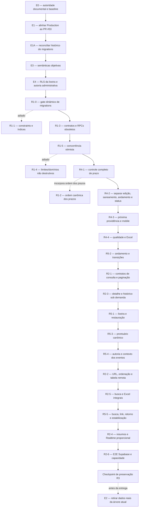

# Plano Executivo da Operação Atual — SITE CTRH v1.2

> **Para agentes executores:** usar `superpowers:subagent-driven-development` (recomendado) ou `superpowers:executing-plans` para executar este plano tarefa por tarefa. Cada tarefa usa checklist e deve terminar com entrega testável, revisão e commit próprios.

**Situação do documento:** baseline executável consolidada do Trilho A, sujeita somente ao controle formal de mudanças previsto neste próprio plano.  
**Escopo:** corrigir, robustecer, escalar e evoluir o SITE CTRH no estado atual, sem depender da chegada dos novos dados do sistema legado.  
**Autoridade:** subordinado ao `Plano_Integrado_Reformulado_CTRH_v3.1.md` e às decisões vigentes do Registro de Decisões de Produto.  
**Efeito documental:** substitui as minutas executivas v1.0 e v1.1; incorpora os achados tecnicamente validados da análise complementar de 26 de julho de 2026, sem adotar sua proposta concorrente de nomenclatura ou transformar recomendações em decisões.  
**Efeito autorizativo:** este documento organiza o trabalho possível; não transforma decisões pendentes em autorização de implementação.

**Objetivo:** levar a operação atual do SITE CTRH a um estado íntegro, seguro, escalável, auditável e funcionalmente maduro, preservando integralmente as decisões do R3 e mantendo compatibilidade arquitetural com a futura incorporação do legado.

**Arquitetura vigente após GOV-012:** a execução ocorre em pacotes pequenos, publicáveis e reversíveis. Depois da linha de base e do E4, conclui-se somente o A1-Core residual em releases separados; em seguida ocorre o debate itemizado do R4 e, após autorização, a evolução funcional de R4/R5. Somente recortes de R2 que forem dependência técnica direta de função aprovada podem ser antecipados; as demais otimizações de escala ficam depois das funções prioritárias. R1-1 e R1-4 autônomo são adiados; R1-2 integra a fundação do R4-1.

**Controle de mudança vigente após GOV-013 e V1-E-A01:** este plano continua sendo o inventário técnico do Trilho A, mas seus pacotes remanescentes não formam uma fila obrigatória para o lançamento. O estado material deve ser verificado antes de cada proposta. Estão autorizados somente o R5 Essencial e a recuperação de senha descritos em `ATUALIZACAO_COMPLETUDE_OPERACIONAL_2026-08-01.md`; R1 residual, R2, R5 avançado, alertas avançados, relatórios adicionais, novos painéis e preferências são evoluções condicionadas. Os ciclos 6 a 13 do Plano Mestre histórico também não definem sequência. Capacidades já materializadas permanecem protegidas; segurança, release proporcional, E2 e a homologação final continuam obrigatórios.

**Stack:** React 19, TypeScript 5.9, Vite 8, React Router 8, TanStack Table 8, Zod 4, Supabase/PostgreSQL, RLS, Realtime, Vitest, Testing Library, Playwright, ExcelJS, GitHub Actions e Vercel.

---

## 1. Restrições globais

Estas regras valem implicitamente para todas as tarefas.

1. Não executar código, migration, Preview ou Production sem autorização expressa do pacote e das decisões de produto que o pacote consome.
2. Um pacote publicável por branch e PR, salvo autorização explícita em contrário.
3. Trabalhar sempre a partir da `main` remota atualizada e em worktree/branch isolados.
4. Escrever o teste que falha antes da implementação de mudança comportamental.
5. Não editar migration já aplicada.
6. Mudanças de banco devem ser aditivas no primeiro release; contratos antigos só podem ser revogados depois que o frontend novo estiver publicado e validado.
7. Não apagar, truncar, sobrescrever ou inventar dados.
8. Não preencher autoria, prazo, responsável, classificação, próxima ação ou evento histórico por inferência.
9. Não usar `origem='legado'` como exceção genérica para enfraquecer constraints da tabela operacional.
10. Dados incompatíveis de futuras cargas legadas deverão permanecer fora da tabela operacional até o Trilho B definir sua reconciliação.
11. Não reabrir nem reexecutar o R3.
12. Preservar `/demandas`, `/minhas-demandas`, redirecionamento de `escopo=meu`, filtros, busca, Excel, acessibilidade, responsividade, perfis, RLS, Realtime e contexto de navegação, salvo decisão expressa.
13. `Tramitado` não equivale a `Encerrado`.
14. Ausência de prazo não equivale a atraso.
15. Demandas sem `responsavel_id` não integram carteira pessoal.
16. Documentação é parte do contrato: toda alteração de regra, permissão, dado, cálculo, rota ou comportamento deve atualizar os documentos vigentes no mesmo PR.
17. Se surgir nova decisão de produto durante a implementação, interromper apenas o item afetado; tarefas independentes podem prosseguir quando forem seguras.
18. Não colocar dados reais, segredos ou conteúdo operacional em fixtures, bundle, logs, screenshots, artefatos ou PRs.
19. Não remover testes para obter aprovação.
20. Todo release deve possuir caminho de rollback documentado.

---

## 2. Autoridade documental e nomenclatura

### 2.1 Estado documental antes do E0

Na `main` auditada, os documentos vigentes foram reconciliados após o R3, mas antecedem o Plano Integrado v3.1 e este Plano Executivo v1.2. Eles continuam vinculantes quanto às decisões já registradas, à governança ciclo a ciclo e às regras consolidadas do R3, porém estão desatualizados quanto à cadeia de autoridade, ao plano executivo vigente, à referência correta do Supabase e à próxima atividade autorizada.

Antes da conclusão do E0, o executor deve tratá-los como **estado pré-reconciliação**:

1. preservar decisões aprovadas e regras materiais ainda válidas;
2. não preservar referências documentais que o E0 foi autorizado a substituir;
3. não interpretar o Plano Remanescente v2.1 como autorização concorrente;
4. não implementar decisões `OP-Dxx` ainda pendentes;
5. usar código, GitHub, Supabase e Vercel como fonte do estado técnico real.

### 2.2 Hierarquia após o E0

Depois do merge e da homologação documental do E0, a ferramenta executora deverá ler, nesta ordem:

1. `docs/execution/ADENDO_GOVERNANCA_POR_ETAPA_CTRH_v2.0.4.md`;
2. `docs/product/PROTOCOLO_HOMOLOGACAO_DECISOES_PRODUTO_CTRH_v1.3.md`;
3. `docs/product/REGISTRO_DECISOES_PRODUTO_CTRH.md`;
4. `docs/product/POLITICA_SINCRONIZACAO_DOCUMENTAL_CTRH_v1.1.md`;
5. `docs/PRODUCT_CONTEXT.md`;
6. `docs/execution/Plano_Integrado_Reformulado_CTRH_v3.1.md`;
7. `docs/execution/Plano_Executivo_Operacao_Atual_CTRH_v1.2.md`;
8. ADRs e documentação técnica aplicáveis;
9. `docs/HANDOFF.md`;
10. documentos anteriores somente como históricos.

As novas versões do Adendo, Protocolo e Política não devem alterar a governança de mérito. Elas devem apenas reconhecer a cadeia documental atual, o controle de mudanças, os dois trilhos coordenados e a autoridade do Plano Integrado v3.1 e do Plano Executivo v1.2.

### 2.3 Caminhos canônicos

O E0 deve criar no repositório:

```text
docs/execution/Plano_Integrado_Reformulado_CTRH_v3.1.md
docs/execution/Plano_Executivo_Operacao_Atual_CTRH_v1.2.md
docs/execution/ADENDO_GOVERNANCA_POR_ETAPA_CTRH_v2.0.4.md
docs/product/PROTOCOLO_HOMOLOGACAO_DECISOES_PRODUTO_CTRH_v1.3.md
docs/product/POLITICA_SINCRONIZACAO_DOCUMENTAL_CTRH_v1.1.md
```

Também deve atualizar `AGENTS.md`, `README.md`, `docs/HANDOFF.md`, `docs/PRODUCT_CONTEXT.md`, `docs/product/REGISTRO_DECISOES_PRODUTO_CTRH.md`, `docs/SUPABASE_SETUP.md` e `docs/execution/HISTORICO_DOCUMENTAL_CTRH.md` para:

- apontar a estratégia geral para o Plano Integrado v3.1;
- apontar a execução do Trilho A para este plano v1.2;
- manter o Registro de Decisões como fonte exclusiva das decisões expressamente aprovadas;
- registrar que a adoção do plano não aprova automaticamente nenhuma decisão `OP-Dxx`;
- marcar o Plano Remanescente v2.1 e as minutas executivas anteriores como históricos/superados para execução;
- corrigir a referência do Supabase para `kdhekkzwcokfrpcrsllr`;
- impedir que dois documentos sejam interpretados como autoridade concorrente.

---

## 3. Linha de base final verificada

### 3.1 GitHub

| Item | Estado |
|---|---|
| Repositório | `WilsonMPeixoto-2/demandas-rhsme-expansao` |
| `main` | `ee61dab5917f84b034305ba2119e4bbad673f176` |
| Última alteração funcional em `main` | PR #53, commit `967a727d25fcbae848a7556da510e9387581f7b7` |
| PR temporário | PR #54, aberto, draft, descartável e não destinado a merge |
| Deploy automático | bloqueado em `vercel.json` |
| Dados reais na árvore | `scripts/bootstrap/initial-demandas.json` contém conteúdo operacional real |

### 3.2 Vercel

| Item | Estado |
|---|---|
| Projeto | `demandas-rhsme-expansao` |
| Production | `READY` |
| Deployment | `dpl_44HusLjkHEJxpKtvWQFfrgJmXvNR` |
| SHA de Production | `98ce45df2e05d223c89227dea244dc53a7d4e363` |
| Diferença funcional | Production está uma evolução funcional atrás da `main` |

### 3.3 Supabase

| Item | Estado |
|---|---:|
| Projeto correto | `CTRH PROCESSOS` |
| Project ref correto | `kdhekkzwcokfrpcrsllr` |
| Demandas | 379 |
| Eventos históricos | 764 |
| Perfis | 13 |
| Demandas com responsável por UUID | 378 |
| Informação textual legada sem UUID | 1 |
| Demandas abertas sem próxima ação | 376 |
| Demandas abertas sem data de acompanhamento | 376 |
| Constraints `NOT VALID` | 5 |
| Violações atuais dessas constraints | 0 |
| Inversões atuais entre prazo interno e final | 0 |
| Links de origem | 0 |
| Demandas logicamente excluídas | 0 |
| `updated_by` nulo em registros legados | 378 |
| Migrations remotas aplicadas sem arquivo homônimo no Git | 2 (`20260723231805`, `20260723232308`) |

### 3.4 Arquitetura atual relevante

- `DemandasRepository.load()` baixa todas as demandas e todo o histórico.
- `useDemandasData` recarrega tudo após cada mutação.
- qualquer evento Realtime nas duas tabelas provoca novo carregamento integral;
- a paginação TanStack é somente local;
- rotas profundas dependem de `demandas.find(...)` na coleção já carregada; `/minhas-demandas/:id` pode abrir uma demanda alheia sob uma rota semanticamente pessoal;
- busca exata e aproximada são executadas em memória;
- Excel recebe a coleção já filtrada no navegador;
- `App.tsx` concentra roteamento, consultas, mutações, filtros, modais, exportação e composição de páginas;
- o contrato público ainda expõe `LegacyCreateDemandaInput`, `update`, `updateStatus` e `delete`;
- a RPC antiga `atualizar_status_sme_demanda` continua executável por `authenticated`;
- políticas RLS atuais permitem que qualquer usuário ativo consulte diretamente demandas logicamente excluídas e seus históricos;
- o histórico remoto contém duas migrations temporárias de `pg_net` sem arquivos homônimos na árvore Git;
- o workflow de migrations move uma lista manual de arquivos;
- importadores administrativos antigos não são compatíveis com o gatilho de responsáveis do R3;
- o gatilho `touch_updated_at` substitui `updated_by` por `auth.uid()`, apagando o ator explícito em chamadas administrativas por `service_role`.

---

## 4. Descobertas finais da auditoria

### 4.1 Gate de migrations frágil

O workflow atual enumera manualmente migrations do Ciclo 4 e do R3. Uma migration futura pode permanecer na pasta durante a reconstrução do banco pré-Ciclo-3, criando replay historicamente incorreto.

**Classificação:** necessidade técnica.  
**Tratamento:** Pacote R1-0.

### 4.2 Caminhos operacionais obsoletos ainda expostos

O frontend já usa as RPCs auditáveis, mas os contratos e adaptadores antigos permanecem disponíveis. A RPC antiga de status:

- altera o status sem próxima ação;
- aceita o status atual;
- não registra `status_anterior` de forma explícita;
- não aplica concorrência otimista;
- continua concedida a `authenticated`.

**Classificação:** risco técnico com decisão de compatibilidade.  
**Tratamento:** OP-D15 e Pacote R1-3.

### 4.3 RLS da lixeira não reflete a intenção da interface

A interface limita lixeira/exclusão a administrador, mas as policies de leitura usam somente `private.is_active()`. Assim, leitor ou editor ativo pode consultar registros excluídos por requisição direta.

**Classificação:** endurecimento de segurança e decisão de permissão.  
**Tratamento:** OP-D17 e Pacote E4.

### 4.4 Regra de ordem dos prazos não é única

O importador valida `limite1 <= limite2`, mas os formulários e RPCs operacionais não utilizam uma função canônica compartilhada, e o banco não possui constraint específica.

**Classificação:** decisão anteriormente confirmada e necessidade técnica.  
**Tratamento:** Pacote R1-2.

### 4.5 Concorrência transacional não impede edição obsoleta

`SELECT ... FOR UPDATE` serializa a transação, mas não detecta que o formulário foi aberto sobre versão antiga. Duas pessoas podem editar sequencialmente, e a última sobrescreve a primeira.

**Classificação:** nova decisão de experiência e necessidade técnica.  
**Tratamento:** OP-D01 e Pacote R1-5.

### 4.6 Edição cadastral e próxima ação estão acopladas

A RPC de edição exige próxima ação/data para toda demanda não encerrada. Como 376 demandas históricas abertas não possuem esses campos, corrigir assunto, responsável, setor ou prazo pode obrigar o usuário a inventar uma providência.

**Classificação:** decisão de produto.  
**Tratamento:** OP-D03 e Pacote R4-2.

### 4.7 Autoria administrativa futura pode ser apagada

O gatilho define `updated_by = auth.uid()`. Em chamada por `service_role`, `auth.uid()` é nulo, embora a função administrativa tenha validado `p_actor_id`.

**Regra final recomendada:** preservar `new.updated_by` somente quando `auth.uid()` for nulo e a escrita vier de função administrativa autorizada. Não preencher retroativamente os 378 valores atuais.

**Classificação:** necessidade técnica e preservação da verdade histórica.  
**Tratamento:** Pacote E4.

### 4.8 Dados reais estão versionados

O arquivo `scripts/bootstrap/initial-demandas.json` contém números, assuntos e nomes reais. A verificação atual garante que esses valores não entrem no bundle, mas não resolve sua presença na árvore Git.

**Classificação:** segurança documental e de dados.  
**Tratamento:** Pacote E2.

### 4.9 Importadores antigos são perigosos, mas não pertencem ao caminho crítico

O importador em lote pode aprovar dry-run e reverter no apply por divergência causada pelo gatilho; o bootstrap pode inserir responsável vazio. Ambos devem ser impedidos de receber novas demandas até o Trilho B.

**Classificação:** salvaguarda transversal com decisão própria.  
**Tratamento:** OP-D18 e Apêndice A. Não bloqueia R1–R5.

---

### 4.10 Histórico remoto de migrations diverge do Git

O Supabase remoto registra as versões `20260723231805_enable_pg_net_for_r3_user_provisioning` e `20260723232308_remove_pg_net_after_r3_user_provisioning`, mas os arquivos homônimos não estão em `supabase/migrations/`. A primeira habilitou `pg_net` temporariamente; a segunda o removeu.

**Classificação:** necessidade técnica de paridade histórica.  
**Tratamento:** Pacote E1A, antes de qualquer nova migration.

### 4.11 A rota pessoal profunda não garante pertencimento

`/minhas-demandas/:id` resolve a demanda pelo array geral já carregado. Um usuário pode abrir uma demanda de outra pessoa dentro de uma rota cujo significado é “minha carteira”, embora a permissão de consulta pela carteira da equipe permaneça válida.

**Classificação:** decisão de navegação.  
**Tratamento:** OP-D20 e R2-3.

### 4.12 “Hoje” e “vencido” não possuem fuso operacional único

A implementação atual depende do relógio do navegador. Com agregações futuras no PostgreSQL, navegador, banco, Excel e testes podem atravessar a meia-noite em momentos diferentes.

**Classificação:** decisão temporal de produto.  
**Tratamento:** OP-D21 e R2-4/R2-6.

### 4.13 Exclusão lógica pode não invalidar outra sessão automaticamente

Ao mudar `deleted_at`, a linha deixa de ser visível por RLS para editor/leitor. Não se deve presumir que Postgres Changes entregará à segunda sessão um evento suficiente para remover o item da interface.

**Classificação:** necessidade de teste arquitetural.  
**Tratamento:** R2-4, com Broadcast privado somente se o comportamento real exigir.

### 4.14 Conflito em RPC `SECURITY DEFINER` pode ampliar leitura

Uma RPC de concorrência não pode devolver indiscriminadamente a linha completa quando ela já não seria consultável pelo usuário, especialmente após exclusão lógica.

**Classificação:** necessidade de segurança.  
**Tratamento:** R1-5; a resposta de conflito jamais pode ampliar o acesso permitido pela RLS.

### 4.15 Valores históricos fora do catálogo exigem preservação explícita

Uma classificação existente que não faça parte da lista curada de criação deve continuar legível e preservável ao editar outro campo. Abrir e salvar o formulário não pode aplicar default nem substituir silenciosamente esse valor.

**Classificação:** preservação do existente.  
**Tratamento:** R1-4.

### 4.16 Paginação, aproximação e feed exigem contratos adicionais

Uma página vazia ainda precisa retornar `total` e `pageCount`; sugestões aproximadas não são resultados exatos e não entram automaticamente em Excel ou indicadores; eventos de migração precisam ser identificados para não aparentarem atividade humana cotidiana.

**Classificação:** necessidade técnica e semântica.  
**Tratamento:** R2-1, R2-5 e E3/R5-4.

---

## 5. Decisões vigentes que não serão reabertas

1. `responsavel_id` é a identidade oficial do responsável.
2. Novas demandas e reatribuições aceitam usuário cadastrado por UUID ou ausência explícita.
3. Nome livre e responsável externo não são permitidos na operação atual.
4. O servidor deriva o nome do perfil quando há UUID.
5. Informação textual legada sem UUID é preservada e não integra carteira pessoal.
6. `Vanessa Migrado` permanece preservada sem UUID.
7. `/demandas` é a carteira geral.
8. `/minhas-demandas` é a carteira pessoal.
9. `escopo=meu` somente redireciona para `/minhas-demandas`.
10. Indicadores e filtros respeitam a carteira da rota.
11. Andamento não muda status.
12. Exclusão é lógica e exige motivo.
13. Mutações passam por RPCs nomeadas e são auditáveis.
14. Os oito tipos de evento atuais permanecem.
15. Prazo possui `definido`, `nao_informado` e `nao_se_aplica`.
16. `nao_se_aplica` exige justificativa.
17. Prazo interno não pode ser posterior ao prazo final quando ambos forem definidos.
18. Ausência de dado legado não pode ser preenchida por inferência.
19. Mudança de regra exige sincronização documental no mesmo PR.

---

## 6. Catálogo de decisões

A situação autorizativa vem exclusivamente do Registro de Decisões. Recomendações de itens ainda pendentes não constituem autorização automática.

### 6.1 Decisões já aprovadas relevantes

| ID | Situação | Regra vigente | Pacote |
|---|---|---|---|
| OP-D01 | Aprovada | rejeitar escrita concorrente, preservar formulário e não fazer merge ou gravação forçada | R1-5 |
| OP-D02 | Implementada | usar semântica neutra de setor e distribuição, sem inferir produtividade | E3 |
| OP-D15 | Aprovada | retirar contratos antigos do cliente e revogar as duas RPCs obsoletas sem grant novo a `service_role` | R1-3 |
| OP-D17 | Implementada | somente administrador ativo consulta demandas e históricos excluídos | E4 |

### 6.2 Catálogo original de decisões então pendentes

Esta tabela preserva as questões identificadas na elaboração do plano. Ela não representa o estado autorizativo atual. Decisões e implementações posteriores prevalecem, especialmente GOV-013 e o R5 Essencial.

| ID | Decisão | Recomendação técnica | Pacote dependente |
|---|---|---|---|
| OP-D03 | Propriedade da próxima ação | retirar da edição genérica; usar `Completar dados operacionais`, `Registrar andamento` e `Alterar status` | R4-2 |
| OP-D04 | Reatribuição isolada | não alterar próxima ação automaticamente; manter alerta para revisão consciente | R4-2 |
| OP-D05 | Apresentação da próxima providência | uma coluna/bloco consolidado com ação e data | R4-3 |
| OP-D06 | Superfície de qualidade | rota administrativa própria `/admin/qualidade` | R4-4 |
| OP-D07 | Reabertura | transição explícita de `Encerrado` para novo status, com motivo, próxima ação e data | R5-2 |
| OP-D08 | Superfície canônica do prontuário | recomendação original superada: página completa e drawer transitório | R5-3 |
| OP-D09 | Identidade legível do autor | gravar snapshot de nome e setor em novos eventos; backfill somente quando comprovável | R5-4 |
| OP-D10 | Contexto do evento | adicionar `operacional`, `administrativo`, `migracao`, `legado`, `nao_classificado` | R5-4 |
| OP-D11 | Restauração | restaurar o registro preservando estado anterior e exigir revisão consciente das lacunas | R5-1 |
| OP-D12 | Link de origem | manter no banco, mas não expor nem exigir até existir fonte institucional definida | R5-5 |
| OP-D13 | Limites de texto | não criar máximo de negócio no Trilho A; manter mínimos úteis, proteção de transporte e ausência de truncamento; medir o legado antes de qualquer `CHECK length` | R1-4 |
| OP-D14 | Catálogo de classificações | catálogo controlado para criação corrente; filtros unem catálogo e valores existentes; edição preserva valor histórico desconhecido até troca consciente | R1-4, R4-4 |
| OP-D16 | Página e ordenação na URL | persistir `pagina`, `porPagina`, `ordenar`, `direcao` | R2-2 |
| OP-D18 | Destino dos importadores incompatíveis | suspender importação de demandas e preservar apenas bootstrap de usuários; não construir o Trilho B agora | Apêndice A |
| OP-D19 | Link interno compartilhável | copiar `/demandas/:id`, sem filtros pessoais | R5-5 |
| OP-D20 | Demanda alheia acessada por `/minhas-demandas/:id` | redirecionar para `/demandas/:id` com mensagem neutra, preservando a consulta sem fingir pertencimento | R2-3 |
| OP-D21 | Fuso operacional do CTRH | usar `America/Sao_Paulo` para “hoje”, vencimento, agregações, Excel e horários exibidos; prazos continuam `date` de calendário | R2-4, R2-6, R4, R5 |
| OP-D22 | Próxima providência já vencida no salvamento | aceitar com aviso e confirmação explícita; não alterar automaticamente nem criar `CHECK >= current_date` | R4-1, R4-2 |
| OP-D23 | Correção de número, tipo e classificação | ação administrativa separada e auditável para número/tipo; classificação permanece na edição normal, sujeita à decisão final | R1-4, R4-2 |

### 6.3 Reclassificação vigente após GOV-013

| Grupo | Estado atual |
|---|---|
| OP-D03, OP-D04, OP-D05, OP-D11 e OP-D22 | Tratados ou superados pelas decisões e implementações homologadas de R4 e R5-1 |
| OP-D07 | Aprovada: reabertura usa a transição de status existente |
| OP-D08 | Aprovada com simplificação: drawer e rotas profundas são o prontuário inicial |
| OP-D09 e OP-D10 | Adiadas como evolução condicionada; nenhuma inferência ou backfill |
| OP-D12 | Adiada; `link_origem` permanece armazenado e não obrigatório |
| OP-D19 | Capacidade básica já materializada pelas rotas profundas; refinamentos adiados |
| OP-D21 e OP-D22 | Tratadas pelas regras temporais do R4 e pelo ADR-002 |
| OP-D01, OP-D06, OP-D13, OP-D14, OP-D16, OP-D20 e OP-D23 | Fora do caminho crítico; reavaliar somente por risco ou necessidade comprovada |
| OP-D18 e Trilho B | Preservados para decisão quando a fonte real do legado estiver disponível |

As seções detalhadas abaixo continuam úteis como especificações de alternativas. Checklists não marcados e recomendações de arquivos não constituem trabalho obrigatório nem autorização atual.

---

## 7. Ordem executiva atualizada por GOV-012



### 7.1 Encadeamento vigente

- O A1-Core contém apenas R1-0, R1-3 e R1-5, nesta ordem lógica, mas usa releases e PRs separados: fundação; banco aditivo; frontend; limpeza pós-Produção.
- R1-1 e R1-4 autônomo ficam adiados; R1-2 é implementado no R4-1.
- Após o A1-Core começa o debate itemizado do R4; somente as decisões expressamente aprovadas seguem para implementação.
- R5 prioriza as funções operacionais. R2-1/R2-3 podem anteceder lixeira e prontuário, e R2-2/R2-5 podem anteceder retorno e busca, somente como dependências diretas das funções aprovadas.
- R2-4, R2-6 e qualquer parcela remanescente de capacidade vêm depois das funções prioritárias e antes da entrega final quando necessárias ao produto atual.
- E2 permanece no pacote final de segurança conforme GOV-011.
- Apêndice A somente é acionado se houver risco concreto de uso dos importadores ou chegada antecipada de arquivo legado.

---

# 8. Pacotes executáveis

## E0 — Consolidar autoridade documental e baseline

**Classificação:** reconciliação documental e necessidade técnica.  
**Decisão documental consumida:** adoção expressamente confirmada do Plano Integrado v3.1 e do Plano Executivo v1.2, sem aprovação automática das decisões `OP-Dxx`.  
**Produz:** cadeia canônica, teste documental e baseline reproduzível.

**Arquivos a criar:**
- `docs/execution/Plano_Integrado_Reformulado_CTRH_v3.1.md`
- `docs/execution/Plano_Executivo_Operacao_Atual_CTRH_v1.2.md`
- `docs/execution/ADENDO_GOVERNANCA_POR_ETAPA_CTRH_v2.0.4.md`
- `docs/product/PROTOCOLO_HOMOLOGACAO_DECISOES_PRODUTO_CTRH_v1.3.md`
- `docs/product/POLITICA_SINCRONIZACAO_DOCUMENTAL_CTRH_v1.1.md`
- `scripts/docs/check-current-plan-references.mjs`
- `scripts/docs/check-current-plan-references.test.mjs`

**Arquivos a atualizar:**
- `AGENTS.md`
- `README.md`
- `docs/PRODUCT_CONTEXT.md`
- `docs/HANDOFF.md`
- `docs/product/REGISTRO_DECISOES_PRODUTO_CTRH.md`
- `docs/SUPABASE_SETUP.md`
- `docs/execution/HISTORICO_DOCUMENTAL_CTRH.md`
- `package.json`, para incluir o gate documental quando aplicável

**Documentos a preservar como históricos:**
- `docs/execution/Plano_Remanescente_Execucao_CTRH_v2.1.md`
- versões anteriores do Adendo, Protocolo e Política;
- planos mestres e minutas anteriores;
- qualquer documento histórico cuja íntegra seja necessária à rastreabilidade.

- [ ] **Passo 1 — Confirmar baseline e ausência dos novos planos na `main`**

  ```bash
  git fetch origin
  git switch main
  git pull --ff-only origin main
  git status --short
  git rev-parse HEAD
  rg -n "Plano_Integrado_Reformulado_CTRH_v3\.1|Plano_Executivo_Operacao_Atual_CTRH_v1\.2" .
  ```

  Registrar o SHA-base e não assumir que anexos externos já estão versionados.

- [ ] **Passo 2 — Criar teste documental RED**

  O teste deve falhar quando:

  - o `AGENTS.md` ou outro documento vigente apontar o Plano Remanescente v2.1 como autoridade executiva atual;
  - os dois novos planos canônicos não existirem;
  - houver mais de um plano marcado como vigente para o mesmo papel;
  - a ordem de leitura divergir da seção 2.2;
  - o project ref incorreto `kdhekkzwcokfrsllr` aparecer em documento vigente;
  - o Handoff autorizar implementação funcional sem decisão registrada;
  - uma decisão `OP-Dxx` for descrita como aprovada apenas pela adoção do plano.

  ```bash
  node --test scripts/docs/check-current-plan-references.test.mjs
  ```

- [ ] **Passo 3 — Versionar os dois planos fornecidos**

  Copiar integralmente os anexos homologados para os caminhos canônicos. Não resumir, reescrever ou completar lacunas durante a cópia.

- [ ] **Passo 4 — Atualizar Adendo, Protocolo e Política**

  Criar as novas versões preservando integralmente a governança existente e alterando somente o necessário para:

  - reconhecer o Plano Integrado v3.1 e o Plano Executivo v1.2;
  - explicitar o controle formal de mudanças;
  - registrar que somente o item afetado para diante de nova decisão;
  - manter Registro de Decisões como fonte exclusiva de aprovação;
  - retirar o Plano Remanescente v2.1 da cadeia de execução atual.

- [ ] **Passo 5 — Sincronizar os documentos operacionais**

  Atualizar `AGENTS.md`, README, Product Context, Registro, Handoff, Supabase Setup e Histórico Documental. Corrigir:

  ```text
  kdhekkzwcokfrsllr
  → kdhekkzwcokfrpcrsllr
  ```

  O Handoff deve registrar:

  - estado real da `main` e de Production;
  - E0 como único pacote documental executado;
  - nenhuma implementação funcional autorizada por esse PR;
  - próximo pacote somente após nova autorização expressa.

- [ ] **Passo 6 — Marcar documentos anteriores como históricos**

  Preservar a íntegra e acrescentar cabeçalho/nota de superação. Não apagar a história nem reescrever decisões antigas como se nunca tivessem existido.

- [ ] **Passo 7 — Executar busca de coerência**

  ```bash
  rg -n "Plano_Remanescente_Execucao_CTRH_v2\.1|Plano_Executivo_Operacao_Atual_CTRH_v1\.[01]|kdhekkzwcokfrsllr" \
    AGENTS.md README.md docs
  ```

  Toda ocorrência restante deve estar explicitamente marcada como histórica ou explicar a transição documental.

- [ ] **Passo 8 — Executar gates**

  ```bash
  npm ci
  node --test scripts/docs/check-current-plan-references.test.mjs
  npm run lint
  npm run test:coverage
  npm run build
  npm run check:bundle
  npm run check:public-bundle
  npm run test:e2e
  ```

- [ ] **Passo 9 — Entrega**

  Um único PR documental, sem frontend, migration, Supabase, Vercel ou Production. Não fazer merge sem autorização.

**Aceite:**
- uma única cadeia documental vigente;
- os dois planos estão versionados integralmente;
- Adendo, Protocolo e Política reconhecem a nova cadeia;
- project ref correto em todos os documentos vigentes;
- nenhuma decisão `OP-Dxx` aparece como aprovada sem registro;
- nenhuma implementação funcional foi feita;
- Handoff descreve o estado remoto real e o próximo passo autorizado.

---

## E1 — Alinhar Production ao estado funcional do PR #53

**Classificação:** necessidade operacional.  
**Decisão necessária:** autorização de publicação.  
**Mudança de banco:** nenhuma.

**Arquivos:**
- Modify temporarily: `vercel.json`
- Modify: `docs/HANDOFF.md`
- Modify: `docs/product/REGISTRO_DECISOES_PRODUTO_CTRH.md`, somente registro operacional quando aplicável

**Interfaces:**
- Consumes: `main` no SHA confirmado.
- Produces: Production funcionalmente alinhada e PR #54 encerrado sem merge.

- [ ] **Passo 1 — Reconfirmar SHA**

  ```bash
  git fetch origin
  git rev-parse origin/main
  ```

  Esperado inicialmente:

  ```text
  ee61dab5917f84b034305ba2119e4bbad673f176
  ```

- [ ] **Passo 2 — Criar branch operacional a partir do SHA exato**

  ```bash
  git switch --create ops/publish-main-pr53 origin/main
  ```

- [ ] **Passo 3 — Executar gate completo**

  ```bash
  npm ci
  npm run check:full
  ```

- [ ] **Passo 4 — Liberar Preview de forma controlada**

  Alterar temporariamente:

  ```json
  {
    "git": {
      "deploymentEnabled": {
        "ops/publish-main-pr53": true
      }
    }
  }
  ```

  Não habilitar deploy irrestrito da `main`.

- [ ] **Passo 5 — Homologar Preview**

  Validar:

  - login;
  - `/`;
  - `/demandas`;
  - `/minhas-demandas`;
  - `escopo=meu`;
  - filtros ativos;
  - paginação 50/100;
  - indicadores por carteira;
  - abertura/fechamento do detalhe;
  - desktop e Pixel 7;
  - administrador, editor e leitor quando disponíveis.

- [ ] **Passo 6 — Publicar o mesmo SHA em Production**

  Confirmar no deployment:

  ```text
  githubCommitSha = SHA homologado
  target = production
  state = READY
  ```

- [ ] **Passo 7 — Restaurar bloqueio**

  ```json
  {
    "git": {
      "deploymentEnabled": false
    }
  }
  ```

- [ ] **Passo 8 — Encerrar PR #54**

  Fechar como descartável, sem merge, depois de Production alinhada.

- [ ] **Passo 9 — Atualizar Handoff e commit operacional**

  ```bash
  git add vercel.json docs/HANDOFF.md
  git commit -m "chore: registrar alinhamento da Production ao PR 53"
  ```

**Rollback:** deployment `dpl_44HusLjkHEJxpKtvWQFfrgJmXvNR`.

---

## E1A — Reconciliar o histórico remoto de migrations

**Classificação:** necessidade técnica de paridade histórica.  
**Decisão nova:** nenhuma.  
**Pré-condição:** E0 concluído.  
**Bloqueio:** nenhum novo pacote com migration começa antes deste pacote.

**Arquivos a criar:**

```text
supabase/migrations/20260723231805_enable_pg_net_for_r3_user_provisioning.sql
supabase/migrations/20260723232308_remove_pg_net_after_r3_user_provisioning.sql
```

Conteúdo comprovado no histórico remoto:

```sql
create extension if not exists pg_net with schema extensions;
```

```sql
drop extension if exists pg_net;
```

**Arquivos a atualizar:**
- testes de inventário/replay de migrations;
- documentação técnica do Supabase;
- `docs/HANDOFF.md`;
- baseline de auditoria, sem dados pessoais.

- [ ] Escrever teste RED que compare as versões remotas registradas na baseline com os nomes dos arquivos SQL do repositório.
- [ ] Confirmar que o teste identifica exatamente as duas versões ausentes.
- [ ] Reconstruir os arquivos com as versões e os statements remotos exatos; não criar versões substitutas.
- [ ] Não executar novamente os statements em Production.
- [ ] Executar `supabase migration list` e provar paridade.
- [ ] Executar replay local completo e verificar que `pg_net` não permanece instalado ao final.
- [ ] Executar `supabase db push --dry-run`; as duas versões já aplicadas não podem ser propostas novamente.
- [ ] Registrar no Handoff que o Git passou a representar a história aplicada, sem mudança remota.

**Aceite:**
- toda versão remota possui arquivo homônimo no Git;
- replay do zero passa;
- `pg_net` está ausente ao final;
- nenhuma tabela, função, grant ou dado de Production foi modificado;
- qualquer diferença entre os statements reconstruídos e a fonte remota interrompe o pacote.

**Rollback:** reverter somente o commit dos arquivos se a reconstrução estiver incorreta. Não alterar a tabela remota de migration history.

---

## E2 — Remover dados reais da árvore corrente do Git

**Classificação:** segurança de dados.  
**Decisão destrutiva separada:** reescrita do histórico Git não integra este pacote.

**Arquivos:**
- Delete: `scripts/bootstrap/initial-demandas.json`
- Create: `scripts/bootstrap/initial-demandas.example.json`
- Modify: `.gitignore`
- Modify: `scripts/bootstrap-supabase.mjs`
- Modify: `scripts/bootstrap-supabase.test.ts`
- Modify: `scripts/check-public-bundle.mjs`
- Modify: `scripts/check-public-bundle.test.ts`
- Modify: `docs/SUPABASE_SETUP.md`
- Modify: `docs/HANDOFF.md`

**Interfaces:**
- Consumes: caminho administrativo externo informado por variável/argumento.
- Produces: fixture sintética e ausência de dados reais no checkout corrente.

- [ ] **Passo 1 — Preservar administrativamente o arquivo**

  Fora do repositório, armazenar:

  - arquivo original;
  - SHA-256;
  - data;
  - responsável pela custódia;
  - finalidade.

  Não registrar o conteúdo no PR.

- [ ] **Passo 2 — Escrever testes RED**

  Os testes devem exigir:

  - ausência de `initial-demandas.json`;
  - fixture `example` inteiramente sintética;
  - erro explícito quando bootstrap for chamado sem caminho administrativo;
  - verificação de bundle capaz de receber caminho externo opcional;
  - nenhum identificador real conhecido nos arquivos versionados correntes.

- [ ] **Passo 3 — Executar RED**

  ```bash
  npm test -- scripts/bootstrap-supabase.test.ts scripts/check-public-bundle.test.ts
  ```

- [ ] **Passo 4 — Criar fixture sintética**

  Usar valores como:

  ```json
  [
    {
      "id": 1,
      "numero": "SME-PRO-2026/00001",
      "tipo": "Processo",
      "assunto": "Exemplo sintético para desenvolvimento",
      "responsavel": "",
      "limite1": "dd/mm/aaaa",
      "limite2": "dd/mm/aaaa",
      "status": "Aguardando Andamento",
      "setor": "E/CTRH",
      "classificacao": "Diversos"
    }
  ]
  ```

- [ ] **Passo 5 — Alterar bootstrap**

  Exigir caminho explícito:

  ```text
  BOOTSTRAP_DEMANDAS_FILE=/caminho/administrativo/arquivo.json
  ```

  Se ausente, o bootstrap de demandas deve ficar desabilitado. O bootstrap de usuários deve continuar independente.

- [ ] **Passo 6 — Atualizar `.gitignore`**

  Incluir:

  ```gitignore
  scripts/bootstrap/initial-demandas.json
  scripts/bootstrap/*.real.json
  migration-input/
  .migration/
  ```

- [ ] **Passo 7 — Verificar árvore corrente**

  ```bash
  git grep -n -I -E "000100\.002864/2026-85|ANDRE LUIS FERREIRA GOMES|Vanessa Migrado"
  ```

  Nenhum dado real deve permanecer em arquivos correntes, exceto documentação técnica que cite uma exceção de produto sem conteúdo processual.

- [ ] **Passo 8 — Gates**

  ```bash
  npm run check:public-bundle
  npm run check:full
  ```

- [ ] **Passo 9 — Commit**

  ```bash
  git add -A
  git commit -m "security: remover dados operacionais da árvore corrente"
  ```

**Fora do escopo:** `git filter-repo`, invalidação de clones e reescrita de SHAs. Tratar em decisão destrutiva específica.

---

## E3 — Corrigir semânticas gerenciais objetivamente inadequadas

**Classificação:** correção de linguagem e prevenção de inferência indevida.  
**Hard gate:** OP-D02.

**Arquivos:**
- Modify: `src/components/VisaoGeral.tsx`
- Modify: `src/export/excelAnalytics.ts`
- Modify: `src/export/exportDemandasExcel.ts`
- Modify: tests associados
- Modify: documentação de produto

**Mudanças recomendadas:**
- `Setores mais Ativos` → `Demandas por setor informado`;
- `Ativas` → `Em acompanhamento`;
- `Ranking de responsáveis — 10 maiores volumes` → `Distribuição por responsável — 10 maiores volumes`;
- remover qualquer texto que associe quantidade a produtividade, desempenho ou atividade humana;
- `Últimas Movimentações Globais` → `Registros recentes do histórico` enquanto o feed misturar eventos operacionais e técnicos; exibir o tipo do evento e não apresentar migration como atividade humana.

- [ ] Escrever testes de microcopy.
- [ ] Confirmar RED.
- [ ] Implementar somente os rótulos aprovados.
- [ ] Verificar desktop, mobile e Excel.
- [ ] Executar `npm run check:full`.
- [ ] Commit:

  ```bash
  git commit -m "fix: neutralizar semânticas gerenciais não comprovadas"
  ```

---

## E4 — Endurecer RLS da lixeira e autoria administrativa

**Classificação:** segurança e integridade de auditoria.  
**Hard gates:** OP-D17 para visibilidade da lixeira e E4-D01 para separação entre responsável e ator.

**Estado:** concluído em Production em 29/07/2026 pelo PR #96, após autorização no PR #94 e reconciliação da versão R3 no PR #95. Migration canônica: `20260729133230_security_deleted_visibility_and_actor.sql`. Nenhuma implementação posterior foi autorizada.

**Arquivos efetivamente alterados no PR #96:**
- Create: `supabase/migrations/20260729133230_security_deleted_visibility_and_actor.sql`
- Create: `supabase/tests/e4_legacy_null_authorship_fixture.sql`
- Create: `supabase/tests/security_deleted_visibility_invariants.sql`
- Modify: `.github/workflows/supabase-local-migrations.yml`

A sincronização documental de encerramento foi executada em PR próprio após a verificação de Production. Não houve alteração de tipos porque o E4 não modificou colunas nem contratos de dados.

**Interfaces:**
- Produces: não-admin só lê demandas ativas; admin lê ativas e excluídas.
- Produces: `updated_by` usa `auth.uid()` em operação autenticada e preserva ator explícito em operação administrativa validada.
- Preserves: a autorização de mutação continua baseada em papel e estado do perfil, nunca em `responsavel_id`.
- Preserves: agir, comentar ou movimentar não reatribui a demanda; somente operação explícita altera o responsável.

- [x] **Passo 1 — Escrever invariantes RED de RLS**

  Provar que:

  - leitor ativo não consulta demanda excluída;
  - editor ativo não consulta demanda excluída;
  - administrador ativo consulta;
  - histórico da demanda excluída segue a mesma regra;
  - todas as demandas ativas continuam visíveis conforme regra vigente;
  - editor pode atuar em demanda cujo `responsavel_id` pertença a outra pessoa;
  - a ação registra o editor em `updated_by` e `sme_historico.created_by`;
  - a ação não altera `responsavel_id` nem o nome derivado do responsável;
  - leitor continua sem permissão de mutação.

- [x] **Passo 2 — Executar RED no Supabase local**

  ```bash
  psql "$LOCAL_DB_URL" -v ON_ERROR_STOP=1 \
    -f supabase/tests/security_deleted_visibility_invariants.sql
  ```

- [x] **Passo 3 — Alterar policy de demandas**

  Regra-alvo:

  ```sql
  using (
    private.is_active()
    and (
      deleted_at is null
      or private.is_admin()
    )
  )
  ```

- [x] **Passo 4 — Alterar policy de histórico**

  Usar existência da demanda visível ao mesmo usuário. Não conceder leitura de histórico excluído por policy independente.

- [x] **Passo 5 — Corrigir `touch_updated_at`**

  Regra:

  ```sql
  new.updated_at := now();
  new.updated_by := coalesce((select auth.uid()), new.updated_by);
  ```

  A prioridade de `auth.uid()` impede que um cliente autenticado escolha outro ator. As RPCs administrativas sem sessão pessoal devem validar o ator antes de atribuir `new.updated_by`. Nenhuma policy ou RPC pode comparar o ator com `responsavel_id` para autorizar a ação.

- [x] **Passo 6 — Provar independência entre responsável e ator**

  Em fixture sintética, atribuir a demanda ao usuário A e executar edição/andamento com o editor B. Confirmar:

  - `responsavel_id` continua sendo A;
  - `updated_by` passa a ser B;
  - o novo evento possui `created_by = B`;
  - o leitor não consegue executar a mesma mutação.

- [x] **Passo 7 — Proibir backfill inferido**

  Confirmar que os 378 `updated_by` nulos continuam nulos. A migration corrige comportamento futuro, não reescreve história.

- [x] **Passo 8 — Replay e Advisors**

  ```bash
  supabase db reset --local --no-seed
  npm run check:full
  ```

  Rodar Advisors e revisar grants.

- [x] **Passo 9 — Commit**

  ```bash
  git commit -m "security: restringir lixeira e preservar autoria administrativa"
  ```


**Evidência de encerramento:** replay integral, invariantes de RLS e autoria, suíte completa, Advisors, grants, políticas, função de gatilho, histórico de migrations, contagens e logs de API foram verificados. Os 378 autores nulos em cada tabela permaneceram nulos; não houve backfill, reatribuição ou deployment da Vercel.
---

# 9. R1 — Integridade, domínio e concorrência

## R1-0 — Tornar o gate de migrations dinâmico

**Estado:** implementado no PR #99 com manifesto canônico e replay efêmero integral.  
**Classificação:** necessidade técnica.  
**Decisão nova:** nenhuma.  
**Pré-condição:** E1A concluído e paridade remoto–Git comprovada.

**Arquivos:**
- Create: `scripts/ci/stage-supabase-migrations.mjs`
- Create: `scripts/ci/stage-supabase-migrations.test.ts`
- Modify: `.github/workflows/supabase-local-migrations.yml`
- Preserve: `package.json`; a descoberta de testes vigente já inclui o novo teste

**Interfaces:**

```ts
export interface StagedMigrationManifest {
  boundary: string;
  baseline: string[];
  cycle3: string;
  postCycle3: string[];
  all: string[];
}
```

- [x] Escrever teste com migration futura fictícia.
- [x] Confirmar que o workflow/lista atual falha em isolá-la.
- [x] Implementar descoberta por nome versionado.
- [x] Separar dinamicamente todas as migrations posteriores à fronteira:

  ```text
  20260722101325_20260722090000_central_trabalho_expand.sql
  ```

- [x] Gerar um único manifesto JSON com o contrato acima: `boundary` é o nome exato da migration-fronteira; `baseline` contém somente arquivos anteriores; `cycle3` contém a própria fronteira; `postCycle3` contém somente arquivos posteriores; `all` é a concatenação cronológica exata dos três estágios.
- [x] Restaurar migrations em ordem cronológica.
- [x] Executar fixture/invariantes do Ciclo 3.
- [x] Aplicar cadeia posterior.
- [x] Executar replay integral.
- [x] Remover variáveis manuais `CYCLE4_*` e `R3_RESPONSAVEIS`.
- [x] Commit:

  ```bash
  git commit -m "ci: tornar gate de migrations independente de lista manual"
  ```

**Aceite:** qualquer migration futura aparece somente no estágio correto e no replay final; staging/restauração deixam a árvore limpa; path traversal, duplicidade e arquivo fora do manifesto são rejeitados.

---

## R1-1 — Validar constraints e completar índices de FK

**Estado após GOV-012:** adiado; não integra o A1-Core nem bloqueia R4.

**Classificação:** necessidade técnica.  
**Pré-condição:** R1-0 verde.

**Arquivos:**
- Create: `supabase/migrations/<next>_r1_validate_constraints_and_indexes.sql`
- Create: `supabase/tests/r1_integrity_invariants.sql`
- Modify: tests de migrations
- Modify: docs técnicos

**Constraints:**

```text
sme_demandas_limite1_consistencia_check
sme_demandas_limite2_consistencia_check
sme_demandas_origem_check
sme_demandas_exclusao_logica_check
sme_historico_tipo_evento_check
```

- [ ] Escrever preflight exato para cada expressão.
- [ ] Testar que fixture inválida interrompe com mensagem nominando a constraint.
- [ ] Validar cada constraint separadamente.
- [ ] Adicionar somente:

  ```sql
  create index if not exists sme_demandas_deleted_by_idx
    on public.sme_demandas (deleted_by)
    where deleted_by is not null;

  create index if not exists sme_importacoes_actor_id_idx
    on private.sme_importacoes (actor_id);
  ```

- [ ] Não duplicar índices já existentes.
- [ ] Provar antes/depois:

  ```text
  demandas = 379
  historico = 764
  perfis = 13
  divergencias UUID–nome = 0
  texto legado sem UUID = 1
  ```

- [ ] Executar replay, Advisors e `npm run check:full`.
- [ ] Commit:

  ```bash
  git commit -m "db: validar constraints e completar índices de integridade"
  ```

---

## R1-2 — Unificar a ordem dos prazos

**Estado após GOV-012:** incorporado ao R4-1; não será executado como pacote autônomo.

**Classificação:** decisão anteriormente confirmada e necessidade técnica.  
**Regra:** quando ambos forem definidos, `prazo interno <= prazo final`.

**Arquivos:**
- Create: `src/domain/deadlineRules.ts`
- Create: `src/domain/deadlineRules.test.ts`
- Create: `supabase/migrations/<next>_r1_deadline_order.sql`
- Create: `supabase/tests/r1_deadline_order_invariants.sql`
- Modify: `src/validation/demandaSchemas.ts`
- Modify: `src/validation/demandMutationSchemas.ts`
- Modify: RPCs de criação e edição por nova migration
- Modify: `src/lib/database.types.ts`
- Modify: ADR de prazos

**Interface:**

```ts
export interface DeadlineValue {
  state: 'definido' | 'nao_informado' | 'nao_se_aplica';
  date: string;
}

export function isDeadlineOrderValid(
  internal: DeadlineValue,
  final: DeadlineValue,
): boolean;
```

- [ ] Testar igualdade, inversão, estados ausentes e datas inválidas.
- [ ] Criar helper SQL canônico.
- [ ] Reutilizar o helper em RPCs.
- [ ] Criar constraint operacional universal:

  ```sql
  check (
    limite1 is null
    or limite2 is null
    or limite1 <= limite2
  )
  ```

- [ ] Não adicionar exceção por `origem`.
- [ ] Preflight confirma zero inversões atuais.
- [ ] Testar que futura linha incompatível não entra em `sme_demandas`; ela deverá permanecer no staging do Trilho B.
- [ ] Executar gates e commit:

  ```bash
  git commit -m "fix: aplicar ordem canônica aos prazos"
  ```

---

## R1-3 — Retirar contratos e RPCs obsoletos

**Estado:** implementado no PR #99; migration `20260729180927_r1_retire_legacy_operational_rpcs.sql`.  
**Classificação:** necessidade técnica com decisão de compatibilidade.  
**Hard gate:** OP-D15.

**Arquivos:**
- Modify: `src/types.ts`
- Modify: `src/services/contracts.ts`
- Modify: `src/services/supabaseDemandasRepository.ts`
- Modify: `src/services/localDemandasRepository.ts`
- Modify: `src/hooks/useDemandasData.ts`
- Modify: tests de contratos
- Create: `supabase/migrations/20260729180927_r1_retire_legacy_operational_rpcs.sql`
- Create: `supabase/tests/r1_retired_rpc_invariants.sql`

**Contrato final de mutação:**

```ts
export interface DemandasMutationRepository {
  create(input: CreateDemandaInput): Promise<void>;
  edit(id: number, input: EditDemandaInput): Promise<void>;
  registerProgress(id: number, input: ProgressInput): Promise<void>;
  transitionStatus(id: number, input: StatusTransitionInput): Promise<void>;
  deleteLogically(id: number, input: DeleteDemandaInput): Promise<void>;
  restore(id: number, input: RestoreDemandaInput): Promise<void>;
}
```

- [x] Fazer busca integral por `LegacyCreateDemandaInput`, `.updateStatus(`, `.update(` e `.delete(`.
- [x] Escrever testes que falham se esses membros existirem no contrato atual.
- [x] Remover adaptadores do hook e repositories.
- [x] Remover a chamada cliente a `criar_sme_demanda`.
- [x] Revalidar que todas as telas usam RPCs auditáveis.
- [x] Revogar `public`, `anon`, `authenticated` e `service_role` de:

  ```text
  atualizar_status_sme_demanda(bigint,text,text)
  criar_sme_demanda(text,text,text,text,date,date,text,text,text)
  ```

- [x] Manter temporariamente os símbolos definidos, sem `EXECUTE` para papéis expostos; não alterar o corpo nem criar consumidor privilegiado.
- [x] Não conceder `service_role`: nenhuma ferramenta administrativa consumidora foi identificada ou autorizada; eventual contrato privilegiado futuro exige decisão própria.
- [x] Testar que a RPC antiga não altera dados nem cria histórico.
- [x] Commit:

  ```bash
  git commit -m "refactor: remover contratos operacionais legados"
  ```

---

## R1-4 — Limites operacionais e domínios não destrutivos

**Estado após GOV-012:** pacote autônomo adiado; nenhum máximo ou catálogo definitivo será inventado antes de necessidade concreta.

**Classificação:** decisão de produto e proteção de dados.  
**Hard gates:** OP-D13 e OP-D14.

**Arquivos:**
- Create: `src/domain/textLimits.ts`
- Create: `src/domain/textLimits.test.ts`
- Modify: schemas Zod
- Modify: RPCs por migration
- Modify: formulários e mensagens
- Modify: catálogo de classificação
- Modify: tests
- Modify: docs

**Princípios:**
- nunca truncar;
- leitura de conteúdo histórico maior continua permitida;
- limite se aplica a nova escrita;
- mensagem informa tamanho atual e máximo;
- `text` do banco não será convertido para `varchar(n)` nesta fase;
- catálogo do frontend não cria `CHECK` fechado de classificação no banco;
- valores históricos desconhecidos permanecem legíveis e filtráveis.

- [ ] Medir percentis e máximos dos campos atuais.
- [ ] Apresentar proposta final de máximos para OP-D13.
- [ ] Escrever testes de borda `max-1`, `max`, `max+1`.
- [ ] Implementar constantes únicas no domínio.
- [ ] Reproduzir os limites nas RPCs.
- [ ] Testar Unicode, quebras de linha e normalização de espaços.
- [ ] Confirmar que nenhum registro existente deixa de ser lido.
- [ ] Commit:

  ```bash
  git commit -m "feat: aplicar limites operacionais sem truncamento"
  ```

---


**Refinamentos obrigatórios de preservação no R1-4:**

- não criar máximo de negócio enquanto o legado completo não tiver sido medido;
- não usar `.slice()`, truncamento em RPC ou conversão silenciosa;
- filtros de classificação devem unir catálogo curado e valores existentes;
- ao editar registro com classificação fora do catálogo, mostrar o valor atual como opção preservada;
- salvar outro campo não pode substituir classificação desconhecida por default;
- número e tipo permanecem sem nova mutação até OP-D23 ser decidida;
- nenhum valor histórico maior ou desconhecido pode se tornar ilegível.

## R1-5 — Concorrência otimista em todas as mutações

**Classificação:** necessidade técnica e decisão de experiência.  
**Hard gate:** OP-D01.

**Arquivos:**
- Create: `src/domain/demandDiff.ts`
- Create: `src/domain/demandDiff.test.ts`
- Create: `src/components/VersionConflictDialog.tsx`
- Create: `src/components/VersionConflictDialog.test.tsx`
- Modify: `src/types.ts`
- Modify: contracts e repositories
- Modify: formulários de mutação
- Create: migrations com RPCs versionadas
- Create: invariantes SQL
- Create: `docs/adr/ADR-006-concorrencia-otimista.md`

**Interface:**

```ts
export interface VersionedMutation {
  expectedUpdatedAt: string;
}
```

**Especificação original, hoje condicionada:** se R1-5 voltar ao caminho de implementação por conflito comprovado, cada release usará branch, PR, gate, evidência e rollback próprios. Não há autorização atual. A decisão posterior de R5-1 também impede reintroduzir restauração de produto.

### Release R1-5A — Banco aditivo

- [ ] Criar:

  ```text
  editar_sme_demanda_v2
  registrar_andamento_sme_demanda_v2
  transicionar_status_sme_demanda_v2
  excluir_sme_demanda_v2
  ```

- [ ] Após `SELECT ... FOR UPDATE`, comparar `updated_at`.
- [ ] Em conflito, lançar código estável `PT409`/`CTRH_VERSION_CONFLICT`.
- [ ] Confirmar que conflito não faz `UPDATE` nem `INSERT` de histórico.
- [ ] Manter assinaturas antigas durante rollout.

### Release R1-5B — Frontend

- [ ] Enviar `expectedUpdatedAt`.
- [ ] Preservar todos os valores digitados.
- [ ] Buscar versão atual.
- [ ] Mostrar campos alterados.
- [ ] Oferecer cancelar, recarregar e copiar conteúdo não salvo.
- [ ] Não oferecer merge automático ou força de gravação.
- [ ] Testar duas sessões concorrentes.

### Release R1-5C — Limpeza

- [ ] Somente após Production usar v2, revogar assinaturas antigas.
- [ ] Antes da limpeza, designar e verificar como rollback um deployment de frontend já compatível com v2; após revogar as assinaturas antigas, o deployment pré-v2 deixa de ser um rollback válido.
- [ ] Commit por release:

  ```bash
  git commit -m "feat: adicionar concorrencia otimista no banco"
  git commit -m "feat: tratar conflitos de versao na interface"
  git commit -m "chore: revogar mutacoes sem controle de versao"
  ```

---

# 10. R2 — Consultas escaláveis e histórico sob demanda

## R2-1 — Separar consultas e mutações; criar paginação no servidor

**Classificação:** necessidade técnica.  
**Decisões novas:** nenhuma para a paginação em si.

**Arquivos:**
- Create: `src/services/demandQueries.ts`
- Create: `src/hooks/useDemandList.ts`
- Create: `src/hooks/useDemandList.test.tsx`
- Modify: `src/services/contracts.ts`
- Modify: `src/services/supabaseDemandasRepository.ts`
- Modify: `src/services/localDemandasRepository.ts`
- Modify: `src/App.tsx`
- Create: migration de RPC de listagem
- Create: invariantes SQL

**Interfaces:**

```ts
export type WorkspaceScope = 'team' | 'mine';

export type DemandSortField =
  | 'numero'
  | 'responsavel'
  | 'limite2'
  | 'proximaAcaoEm'
  | 'status'
  | 'updatedAt';

export interface DemandListQuery {
  scope: WorkspaceScope;
  filters: DemandFilters;
  search: string;
  page: number;
  pageSize: 10 | 25 | 50 | 100;
  sort: DemandSortField;
  direction: 'asc' | 'desc';
}

export interface Page<T> {
  items: T[];
  total: number;
  page: number;
  pageSize: number;
  pageCount: number;
}
```

- [ ] Escrever testes do repository paginado.
- [ ] Criar RPC `listar_sme_demandas`.
- [ ] Para `scope='mine'`, usar `auth.uid()`; não aceitar UUID do cliente.
- [ ] Aplicar filtros, `total` e `pageCount` no servidor; uma página vazia continua retornando metadados corretos, sem depender de row visível.
- [ ] Ordenar com desempate por `id`.
- [ ] Excluir logicamente removidas da listagem normal.
- [ ] Preservar página inicial 50 e máximo 100.
- [ ] Adaptar modo local com dados sintéticos.
- [ ] Remover `load(): AppData` somente após todos os consumidores migrarem.
- [ ] Dividir responsabilidades excessivas de `App.tsx` em hooks/páginas focados, sem refatoração não relacionada.
- [ ] Commit:

  ```bash
  git commit -m "feat: consultar demandas com paginacao no servidor"
  ```

---

## R2-2 — Persistir paginação e ordenação na URL

**Classificação:** decisão de experiência.  
**Hard gate:** OP-D16.

**Arquivos:**
- Modify: `src/filters/filterTypes.ts`
- Modify: `src/filters/filterUrl.ts`
- Create: `src/services/queryState.ts`
- Create: `src/services/queryState.test.ts`
- Modify: `src/components/DemandasTable.tsx`
- Modify: `src/App.tsx`
- Modify: E2E de rotas

**Parâmetros:**

```text
pagina
porPagina
ordenar
direcao
```

- [ ] Escrever testes de parse/serialize.
- [ ] Confirmar que filtros antigos continuam válidos.
- [ ] Configurar TanStack em modo manual.
- [ ] Trocar página por nova consulta.
- [ ] Resetar página para 1 quando filtro mudar.
- [ ] Manter página ao abrir e retornar de uma demanda.
- [ ] Testar back/forward do navegador.
- [ ] Commit:

  ```bash
  git commit -m "feat: preservar pagina e ordenacao na URL"
  ```

---

## R2-3 — Consulta individual e histórico com cursor

**Classificação:** necessidade técnica e decisão de navegação.  
**Hard gate parcial:** OP-D20 para o comportamento da rota pessoal.

**Arquivos:**
- Create: `src/hooks/useDemandDetail.ts`
- Create: `src/hooks/useDemandHistory.ts`
- Create: tests
- Modify: repositories
- Modify: `src/App.tsx`
- Modify: drawer/modal transitórios
- Create: RPCs de leitura e invariantes

**Interfaces:**

```ts
export interface HistoryCursor {
  createdAt: string;
  id: number;
}

export interface HistoryPage {
  items: ComentarioHistorico[];
  nextCursor: HistoryCursor | null;
  total: number;
}

getDemanda(id: number): Promise<Demanda | null>;

listHistorico(input: {
  demandaId: number;
  cursor?: HistoryCursor;
  limit?: number;
}): Promise<HistoryPage>;
```

- [ ] Escrever teste que acessa `/demandas/123` sem carregar lista.
- [ ] Escrever teste de cursor estável com evento inserido entre páginas.
- [ ] Implementar `getDemanda`.
- [ ] Implementar histórico ordenado por `(created_at desc, id desc)`.
- [ ] Carregar primeira página de 30.
- [ ] Diferenciar não encontrado de não autorizado sem vazamento.
- [ ] Preservar rota/filtros de retorno.
- [ ] Remover `demandas.find(...)` como requisito de deep link.
- [ ] Em `/minhas-demandas/:id`, verificar pertencimento por `responsavel_id = auth.uid()`; quando a demanda for consultável mas alheia, redirecionar para `/demandas/:id` conforme OP-D20, sem fingir pertencimento.
- [ ] Commit:

  ```bash
  git commit -m "feat: carregar detalhe e historico sob demanda"
  ```

---

## R2-4 — Resumos agregados e Realtime proporcional

**Classificação:** necessidade técnica.  
**Hard gates parciais:** OP-D02 para rótulos de setor e OP-D21 para datas relativas.

**Arquivos:**
- Create: `src/hooks/useWorkspaceSummary.ts`
- Create: `src/hooks/useOverviewSnapshot.ts`
- Create: `src/hooks/useRealtimeInvalidation.ts`
- Create: tests
- Modify: `Header.tsx`
- Modify: `VisaoGeral.tsx`
- Modify: `AtencaoImediata.tsx`
- Modify: repositories e RPCs

**Interfaces:**

```ts
getWorkspaceSummary(scope: WorkspaceScope): Promise<WorkspaceSummary>;
getOverviewSnapshot(scope: WorkspaceScope): Promise<OverviewSnapshot>;
getAttentionItems(scope: WorkspaceScope): Promise<AttentionItem[]>;
```

- [ ] Testar que indicadores não dependem da página visível.
- [ ] Implementar agregações no servidor.
- [ ] Preservar lógica: ausente não é vencido; encerrado não integra acompanhamento.
- [ ] Substituir reload integral por invalidação:

  ```text
  demanda X mudou
  → invalidar página atual quando afetada
  → invalidar detalhe X
  → invalidar resumo
  → invalidar histórico X quando necessário
  ```

- [ ] Agrupar rajadas em 300 ms.
- [ ] Cancelar/ignorar resposta obsoleta de filtro anterior.
- [ ] Testar 20 eventos rápidos com número limitado de consultas.
- [ ] Testar com duas sessões a exclusão lógica que torna a linha invisível por RLS; comprovar que a segunda sessão remove o item.
- [ ] Se Postgres Changes não fornecer sinal suficiente, submeter e implementar Broadcast privado de invalidação com payload mínimo, em vez de aceitar estado obsoleto indefinido.
- [ ] Unificar “hoje” e “vencido” no fuso aprovado por OP-D21 entre SQL, TypeScript, Excel e testes próximos da meia-noite.
- [ ] Não transformar `AtencaoImediata` no futuro motor R6.
- [ ] Commit:

  ```bash
  git commit -m "perf: tornar resumos e realtime proporcionais"
  ```

---

## R2-5 — Preservar busca e Excel no recorte integral

**Classificação:** preservação funcional e necessidade técnica.

**Arquivos:**
- Modify: search modules
- Create: testes de paridade SQL/TypeScript
- Modify: repositories
- Modify: Excel modules
- Modify: `App.tsx`

**Regras de busca a preservar:**
- normalização de acentos e caixa;
- número compactado;
- correspondência exata em todos os termos;
- histórico pesquisável;
- aproximação somente após zero exatos;
- aproximação somente com três ou mais termos;
- pesos atuais;
- no máximo dez sugestões;
- indicação visual de aproximação.

**Interface de exportação:**

```ts
export interface DemandExportQuery
  extends Omit<DemandListQuery, 'page' | 'pageSize'> {}

listDemandasForExport(query: DemandExportQuery): Promise<Demanda[]>;
```

- [ ] Criar corpus sintético de paridade.
- [ ] Implementar busca remota sem alterar semântica.
- [ ] Medir SQL antes de adicionar extensão/índice complexo.
- [ ] Exportar todo o recorte exato, nunca apenas a página. Sugestões aproximadas não integram totais, indicadores ou Excel como resultados exatos.
- [ ] Testar: 125 registros, página de 50, Excel com 125.
- [ ] Não truncar exportação silenciosamente.
- [ ] Registrar quantidade exportada.
- [ ] Preservar sanitização contra fórmula.
- [ ] Commit:

  ```bash
  git commit -m "feat: preservar busca e Excel com consulta paginada"
  ```

---

## R2-6 — E2E Supabase e testes de capacidade

**Classificação:** necessidade técnica.

**Arquivos:**
- Create: `playwright.supabase.config.ts`
- Create: `tests/e2e-supabase/*`
- Create: `.github/workflows/supabase-e2e.yml`
- Modify: `package.json`
- Create: scripts de massa sintética
- Create: relatório de benchmark

**Matriz:**

| Papel | Geral | Pessoal | Mutação | Administração | Lixeira |
|---|---:|---:|---:|---:|---:|
| administrador | sim | sim | sim | sim | sim |
| editor | sim | sim | sim | não | não |
| leitor | sim | sim | não | não | não |

**Massa mínima:**
- 5.000 demandas sintéticas;
- 50.000 eventos;
- distribuição realista de status, responsáveis, prazos e lacunas;
- zero dado de Production.

- [ ] Testar autenticação/papéis.
- [ ] Testar paginação remota.
- [ ] Testar deep links.
- [ ] Testar RLS.
- [ ] Testar Realtime, inclusive linha que deixa de ser visível por RLS.
- [ ] Congelar instantes próximos da meia-noite no fuso OP-D21 e provar paridade entre navegador, SQL e Excel.
- [ ] Testar Excel.
- [ ] Executar `EXPLAIN (ANALYZE, BUFFERS)` nas consultas críticas.
- [ ] Registrar:

  - tempo mediano e p95;
  - payload;
  - número de consultas;
  - plano de execução;
  - índices usados;
  - comportamento com busca histórica.

- [ ] Não inventar SLA antes da primeira medição.
- [ ] Aprovar orçamento de desempenho antes de Production.
- [ ] Commit:

  ```bash
  git commit -m "test: adicionar E2E Supabase e benchmark de capacidade"
  ```

---

# 11. Checkpoint de preservação do R3

Não criar um novo ciclo R3.

- [ ] 378 demandas continuam ligadas a UUID.
- [ ] Uma informação textual legada continua preservada.
- [ ] Zero divergências UUID–nome.
- [ ] Cadastro corrente não aceita texto livre.
- [ ] `/demandas` e `/minhas-demandas` permanecem distintas.
- [ ] `escopo=meu` redireciona preservando filtros.
- [ ] Indicadores usam a carteira correta.
- [ ] `scope='mine'` usa `auth.uid()` no servidor.
- [ ] Demanda sem UUID não entra na carteira pessoal.
- [ ] Excel respeita o escopo integral.
- [ ] Edição de outro campo não apaga o texto legado.

Falha em qualquer item bloqueia R4.

---

# 12. R4 — Prazos, próxima providência e qualidade

## R4-1 — Componente completo de prazo

**Classificação:** completar decisão vigente.
**Hard gate parcial:** OP-D22 para a validação de próxima providência vencida.

**Arquivos:**
- Create: `src/components/DeadlineControl.tsx`
- Create: `src/components/DeadlineControl.test.tsx`
- Create: `src/components/DeadlineDisplay.tsx`
- Create: `src/domain/deadlineDisplay.ts`
- Modify: formulários, schemas e types

**Interface:**

```ts
export interface DeadlineFormValue {
  state: 'definido' | 'nao_informado' | 'nao_se_aplica';
  date: string;
  justification: string;
}
```

- [ ] `Definido` mostra data e limpa justificativa.
- [ ] `Não informado` limpa data e justificativa.
- [ ] `Não se aplica` limpa data e exige justificativa.
- [ ] Mudança de estado não envia valor oculto.
- [ ] Ordem dos prazos usa `deadlineRules`.
- [ ] Legado vazio continua `nao_informado`.
- [ ] Prazo ausente não recebe badge de atraso.
- [ ] Testar teclado, leitor de tela e mobile.
- [ ] Aplicar OP-D22: data de próxima providência já vencida não é corrigida automaticamente; o comportamento de aviso/confirmação deve ser testado sem `CHECK >= current_date`.
- [ ] Commit:

  ```bash
  git commit -m "feat: completar estados e experiencia dos prazos"
  ```

---

## R4-2 — Separar edição, saneamento, andamento e status

**Classificação:** decisão de produto.  
**Hard gates:** OP-D03 e OP-D04.

### Contratos recomendados

**Editar dados:**
- assunto;
- responsável;
- setor informado;
- classificação;
- prazos;
- link somente quando OP-D12 for aprovada.

**Completar dados operacionais:**
- próxima ação;
- data;
- justificativa;
- apenas para lacuna atual.

**Registrar andamento:**
- realizado;
- próxima ação;
- data;
- status permanece.

**Alterar status:**
- novo status;
- comentário;
- próxima ação/data, ou limpeza ao encerrar.

**Interface:**

```ts
export interface CompleteOperationalDataInput
  extends VersionedMutation {
  proximaAcao: string;
  proximaAcaoEm: string;
  justificativa: string;
}
```

**Arquivos:**
- Modify: `EditDemandaInput`
- Create: modal/ação de completar dados
- Create: RPC versionada
- Modify: edição e status
- Create: tests

- [ ] Remover próxima ação do contrato de edição genérica.
- [ ] Permitir corrigir cadastro sem inventar providência.
- [ ] Manter alerta de lacuna.
- [ ] `Completar` só preenche campo ausente; não substitui andamento recorrente.
- [ ] Reatribuição não altera próxima ação automaticamente.
- [ ] Andamento/status ficam bloqueados enquanto faltar dado exigido, conforme regra aprovada.
- [ ] Registrar antes/depois e contexto administrativo.
- [ ] Aplicar concorrência.
- [ ] Commit:

  ```bash
  git commit -m "feat: separar saneamento de andamento e status"
  ```

---

## R4-3 — Exibir próxima providência e criar experiência mobile equivalente

**Classificação:** decisão de apresentação.  
**Hard gate:** OP-D05.

**Arquivos:**
- Modify: `DemandasTable.tsx`
- Create: `DemandasMobileList.tsx`
- Create: `DemandSummaryCard.tsx`
- Modify: detalhe transitório
- Modify: filters
- Create: tests

- [ ] Desktop: coluna consolidada com ação e data.
- [ ] Estados: atrasada, hoje, futura, não informada, não exigida por encerramento.
- [ ] Não criar faixa “próxima” sem regra aprovada.
- [ ] Mobile deve mostrar:

  - número;
  - assunto;
  - responsável;
  - status;
  - próxima ação;
  - data;
  - prazos;
  - ação para abrir.

- [ ] Drawer transitório destaca próxima providência.
- [ ] Testar texto longo, ausência, vencimento, leitor, Pixel 7 e sem overflow.
- [ ] Commit:

  ```bash
  git commit -m "feat: destacar proxima providencia na carteira"
  ```

---

## R4-4 — Painel de qualidade e Excel

**Classificação:** decisão de produto.  
**Hard gate:** OP-D06.

**Rota recomendada:**

```text
/admin/qualidade
```

**Tipos:**

```ts
export type QualityIssueCode =
  | 'responsavel_legado_sem_uuid'
  | 'sem_responsavel'
  | 'prazo_interno_nao_informado'
  | 'prazo_final_nao_informado'
  | 'prazo_invertido'
  | 'proxima_acao_ausente'
  | 'data_acompanhamento_ausente'
  | 'historico_operacional_insuficiente';
```

- [ ] Criar consulta agregada e paginada.
- [ ] Diferenciar nome legado sem UUID de não atribuído.
- [ ] Não corrigir automaticamente.
- [ ] Abrir a demanda na superfície canônica/atual.
- [ ] Não considerar evento de migração como movimentação operacional.
- [ ] Adicionar ao Excel:

  - estados e justificativas de prazo;
  - próxima ação/data;
  - códigos de qualidade;
  - UUID do responsável;
  - indicação de texto legado.

- [ ] Confirmar que as 376 lacunas permanecem sem alteração.
- [ ] Commit:

  ```bash
  git commit -m "feat: tornar lacunas operacionais localizaveis"
  ```

---

# 13. R5 — Andamento, prontuário e recuperação

## R5-1 — Lixeira administrativa e restauração

**Classificação:** evolução administrativa.  
**Hard gates:** OP-D11 e OP-D17.  
**Pré-condição:** RLS já endurecida em E4.

**Arquivos:**
- Create: `src/pages/AdminTrashPage.tsx`
- Create: `src/components/TrashTable.tsx`
- Create: `src/components/RestoreDemandaDialog.tsx`
- Create: `src/hooks/useTrashList.ts`
- Create: tests e E2E
- Modify: routing e repository

**Rota:**

```text
/admin/lixeira
```

- [ ] Listar de forma paginada.
- [ ] Mostrar demanda, responsável, status, exclusão, autor e motivo.
- [ ] Abrir em modo somente leitura.
- [ ] Restaurar com motivo e `expectedUpdatedAt`.
- [ ] Leitor/editor recebem negação no banco, não apenas na UI.
- [ ] Restauração não inventa próxima ação.
- [ ] Aplicar comportamento aprovado em OP-D11.
- [ ] Confirmar exclusão física proibida.
- [ ] Commit:

  ```bash
  git commit -m "feat: adicionar lixeira administrativa auditavel"
  ```

---

## R5-2 — Expor andamento e corrigir transição de status

**Classificação:** completar capacidade já existente e decisão de reabertura.  
**Hard gate parcial:** OP-D07.

**Arquivos:**
- Create: `src/components/ModalAndamento.tsx`
- Create: tests
- Modify: `ModalStatus.tsx`
- Modify: actions da carteira/detalhe
- Modify: routing/state

- [ ] Andamento pede:

  ```text
  O que foi realizado
  Próxima providência
  Data de acompanhamento
  ```

- [ ] Mostrar permanentemente: `O status permanecerá “Tramitado”.`
- [ ] Não oferecer andamento para excluída/encerrada.
- [ ] Status atual não pode ser pré-selecionado como ação válida.
- [ ] Retirar status atual das opções.
- [ ] Encerramento limpa próxima ação/data.
- [ ] Reabertura segue OP-D07.
- [ ] Preservar formulário em conflito.
- [ ] Retornar à rota, página e foco.
- [ ] Commit:

  ```bash
  git commit -m "feat: expor andamento e tornar transicao deliberada"
  ```

---

## R5-3 — Criar prontuário canônico

**Classificação:** decisão de arquitetura e experiência.  
**Hard gate:** OP-D08.

**Arquivos:**
- Create: `src/pages/DemandRecordPage.tsx`
- Create: `src/components/demand-record/*`
- Create: tests
- Modify: routing
- Descontinuar gradualmente: drawer e modal de histórico independentes

**Rotas:**

```text
/demandas/:id
/minhas-demandas/:id
```

**Estrutura:**
1. número, assunto e status;
2. próxima providência;
3. ações permitidas;
4. responsabilidade;
5. prazos;
6. dados cadastrais;
7. timeline;
8. estado de exclusão quando aplicável.

- [ ] Carregar detalhe e histórico sem lista inteira.
- [ ] Timeline mais recente primeiro.
- [ ] Mostrar tipo, data/hora, autor, setor, status anterior/resultante, comentário e antes/depois.
- [ ] Recolher detalhes, nunca ocultar evento.
- [ ] Ação `Histórico` vira link para `#historico`.
- [ ] Evitar drawer + modal + página como três fontes concorrentes.
- [ ] Testar timeline vazia, curta e extensa.
- [ ] Commit:

  ```bash
  git commit -m "feat: criar prontuario canonico da demanda"
  ```

---

## R5-4 — Snapshot de autoria e contexto dos eventos

**Classificação:** decisão de modelo de histórico.  
**Hard gates:** OP-D09 e OP-D10.

**Banco recomendado:**

```sql
actor_name_snapshot text,
actor_sector_snapshot text,
event_source text
```

**Tipo recomendado:**

```ts
export type HistoryEventSource =
  | 'operacional'
  | 'administrativo'
  | 'migracao'
  | 'legado'
  | 'nao_classificado';
```

- [ ] Novos eventos gravam snapshot no momento da ação.
- [ ] Autor inativo continua legível.
- [ ] Evento sem autor permanece sem autor.
- [ ] Backfill somente com evidência:

  - `created_by` com perfil correspondente;
  - reatribuições exatas do R3 como `migracao`;
  - criações importadas comprovadas como `legado`;
  - demais como `nao_classificado`.

- [ ] Não atribuir autoria humana a migração.
- [ ] Eventos de migração permanecem acessíveis, mas podem ser visualmente recolhidos.
- [ ] Feed global não deve ser dominado por eventos técnicos quando o contexto aprovado permitir filtragem.
- [ ] Commit:

  ```bash
  git commit -m "feat: preservar autoria legivel e contexto do historico"
  ```

---

## R5-5 — Busca histórica, links e retorno exato

**Classificação:** estabilização e decisões de navegação.  
**Hard gates:** OP-D12 e OP-D19 nos itens correspondentes.

- [ ] Busca do servidor inclui, se aprovado:

  - tipo amigável;
  - autor snapshot;
  - status anterior/resultante;
  - comentário;
  - campos alterados;
  - valores antes/depois.

- [ ] Resultado informa por que correspondeu.
- [ ] Copiar link gera `/demandas/:id`.
- [ ] Não incluir filtros pessoais ou dados sensíveis.
- [ ] Voltar preserva:

  - carteira;
  - query;
  - página;
  - ordenação;
  - scroll;
  - foco.

- [ ] `link_origem` permanece invisível/não obrigatório enquanto OP-D12 estiver adiada.
- [ ] Executar bateria final de acessibilidade, mobile, papéis, RLS, Realtime e performance.
- [ ] Commit:

  ```bash
  git commit -m "feat: estabilizar busca e navegacao do prontuario"
  ```

---

# 14. Apêndice A — Salvaguarda do legado fora do caminho crítico

## A.1 Regra

Nenhuma nova carga deve usar:

```text
bootstrap_importar_demanda
importar_sme_demandas_lote
criar_sme_demanda
```

para inserir demandas até o Trilho B.

## A.2 Pacote opcional de quarentena

**Hard gate:** OP-D18.

- [ ] Separar bootstrap de usuários do bootstrap de demandas.
- [ ] Fazer caminhos de demanda retornarem erro explícito:

  ```text
  Importação de demandas suspensa após o R3. Preserve o arquivo e utilize o fluxo do Trilho B.
  ```

- [ ] Manter arquivos recebidos fora do Git, com hash e custódia administrativa.
- [ ] Não criar staging/cofre agora, salvo chegada concreta de arquivo antes do Trilho B.
- [ ] Não tocar em `sme_demandas`.
- [ ] Não apagar as 318 trilhas existentes nem inventar proveniência para as 61 demandas sem item formal.

## A.3 Contingência de recepção bruta

Se um arquivo chegar antes do Trilho B, abrir pacote específico e deliberar:

- armazenamento bruto privado;
- hash do arquivo e linhas;
- retomada de upload;
- acesso somente service role;
- nenhuma promoção automática.

Esse pacote não é pré-requisito para R1–R5.

---

# 15. Invariantes transversais protegidos

1. UUIDs diferentes nunca compartilham carteira por igualdade de nome.
2. Nome legado sem UUID não vira “Sem responsável”.
3. “Sem responsável” exige UUID nulo e texto vazio.
4. Texto legado não pode ser apagado ao editar outro campo.
5. Ausência de prazo não é vencimento.
6. Prazo não aplicável exige justificativa.
7. Prazo interno não supera prazo final.
8. `Tramitado` não é encerrado.
9. Andamento não altera status.
10. Transição de status não é andamento.
11. Conflito não altera demanda nem cria evento.
12. Exclusão é lógica.
13. Não-admin não lê lixeira por requisição direta.
14. Histórico não fica órfão.
15. Excel exporta todo o recorte, não somente a página.
16. Indicadores usam toda a carteira, não a página.
17. Carteira pessoal é resolvida por `auth.uid()` no servidor.
18. Realtime não dispara reload integral por evento.
19. Resposta obsoleta não substitui filtro recente.
20. Deep link não depende da lista carregada.
21. Eventos técnicos não podem dominar a leitura operacional sem identificação.
22. Setor não pode ser descrito como produtividade.
23. Dados reais não podem permanecer na árvore corrente ou bundle.
24. Ausência histórica de autoria não pode ser preenchida por inferência.
25. Novas cargas legadas incompatíveis não entram na tabela operacional.
26. Toda versão de migration aplicada remotamente possui arquivo homônimo e replayável no Git.
27. `/minhas-demandas/:id` não apresenta demanda alheia como integrante da carteira pessoal.
28. Uma resposta de conflito nunca amplia a leitura permitida pela RLS.
29. Página vazia continua informando `total` e `pageCount` corretos.
30. Resultado aproximado é sugestão e não integra Excel, indicadores ou total exato.
31. “Hoje” e “vencido” usam o mesmo fuso aprovado em cliente, SQL, Excel e testes.
32. Data vencida informada pelo usuário nunca é transformada automaticamente em data futura.
33. Linha que deixa de ser visível por RLS não permanece indefinidamente na interface de outra sessão.
34. Classificação histórica fora do catálogo não é apagada ou substituída ao editar outro campo.
35. Evento de migração ou técnico não é apresentado como atividade humana sem identificação.

---

# 16. Protocolo obrigatório de cada PR

1. Atualizar `origin/main`.
2. Confirmar SHA, migrations remotas e worktree limpo.
3. Criar branch própria.
4. Registrar baseline de dados relevante.
5. Escrever teste RED.
6. Confirmar RED.
7. Implementar somente o pacote autorizado.
8. Executar testes focados.
9. Executar replay Supabase quando houver SQL.
10. Regenerar tipos e revisar diff.
11. Rodar Advisors e revisar grants.
12. Executar:

```bash
npm ci
npm audit --audit-level=high
npm audit signatures
npm run lint
npm run test:coverage
npm run build
npm run check:bundle
npm run check:public-bundle
npm run test:e2e
```

13. Atualizar documentos vigentes no mesmo PR.
14. Abrir PR com:
    - fatos;
    - decisões;
    - escopo;
    - exclusões;
    - dados antes/depois;
    - evidências;
    - riscos;
    - rollback.
15. Homologar Preview no SHA exato.
16. Publicar somente após autorização.
17. Verificar Production, logs, banco e domínio.
18. Restaurar bloqueio automático.
19. Atualizar Handoff.
20. Encerrar apenas quando código, banco, testes, documentação e Production concordarem.

---

# 17. Estratégia de rollout e rollback

## 17.1 Banco

- mudanças inicialmente aditivas;
- RPC nova antes de revogar antiga;
- frontend novo antes de limpeza de contrato;
- correção para frente por nova migration;
- não usar down migration improvisada;
- não restaurar tabela inteira sobre dados criados depois do release.

## 17.2 Frontend

- Preview no SHA do PR;
- rollback por deployment anterior;
- versão antiga deve continuar compatível com banco aditivo no primeiro release.

## 17.3 Dados

- snapshot privado somente de tabelas/colunas afetadas;
- nenhum snapshot em Git;
- backfill com contagem, origem e prova;
- nenhuma correção em massa sem dry-run e autorização.

---

# 18. Condições de parada

Interromper o item quando:

1. exigir decisão não registrada;
2. dois documentos vigentes divergirem;
3. migration remota não corresponder ao repositório, inclusive versão aplicada sem arquivo homônimo;
4. baseline mudar sem explicação;
5. preflight encontrar violação;
6. RLS/grant ampliar acesso não aprovado;
7. teste indicar perda/truncamento;
8. rollback depender de apagar dados posteriores;
9. pacote misturar refatoração não relacionada;
10. Preview não corresponder ao SHA do PR;
11. evento histórico ou autoria precisar ser inventado;
12. implementação exigir enfraquecer tabela operacional para aceitar legado;
13. CI só ficar verde mediante remoção/omissão de teste;
14. Production divergir do estado homologado;
15. RPC `SECURITY DEFINER` puder devolver dados que a RLS ocultaria;
16. o comportamento de Realtime ao perder visibilidade não tiver sido comprovado;
17. cliente, SQL e Excel discordarem sobre “hoje” ou “vencido”.

O restante pode continuar apenas quando for independente e seguro.

---

# 19. Definição de pronto por pacote

Um pacote está concluído somente quando:

- decisão consumida está registrada;
- escopo e exclusões estão explícitos;
- testes RED/GREEN existem;
- testes focados e gate integral estão verdes;
- migrations replayam do zero;
- RLS/grants foram verificados;
- dados antes/depois foram registrados;
- acessibilidade e mobile foram homologados quando aplicáveis;
- Preview usa o SHA do PR;
- Production foi autorizada, publicada e verificada;
- bloqueio automático foi restaurado;
- documentação vigente está sincronizada;
- Handoff registra o estado real;
- rollback está disponível;
- não há orientação antiga concorrente.

---

# 20. Primeiro bloco recomendável para autorização

## Bloco 1 — Fundação e segurança

1. E0 — autoridade documental;
2. E1 — Production no PR #53;
3. E1A — reconciliar as duas migrations remotas ausentes no Git;
4. E2 — retirar dados reais da árvore corrente;
5. R1-0 — gate dinâmico de migrations;
6. R1-1 — constraints e índices.

## Bloco 2 — Decisões imediatas

Antes de R1-3/R1-5/E4, deliberar:

1. OP-D17 — lixeira somente para administrador;
2. OP-D15 — revogação das RPCs antigas;
3. OP-D01 — conflito concorrente;
4. OP-D02 — semântica provisória de setor;
5. OP-D18 — quarentena dos importadores incompatíveis;
6. OP-D20 — rota pessoal com demanda alheia;
7. OP-D21 — fuso operacional;
8. OP-D22 — próxima providência já vencida;
9. OP-D23 — correção de identificação.

## Bloco 3 — Integridade funcional

1. E4;
2. R1-2;
3. R1-3;
4. R1-4;
5. R1-5.

Depois de homologar o A1-Core, iniciar R4. R2 vem depois das funções prioritárias, conforme GOV-012.

---

# 21. Handoff ao executor

O executor deverá:

1. ler a hierarquia documental;
2. confirmar a decisão/autorização do pacote;
3. não executar tarefas dependentes de decisão pendente;
4. criar worktree/branch;
5. seguir os checklists na ordem;
6. produzir evidências;
7. parar apenas o item que encontrar nova decisão;
8. nunca interpretar este plano como autorização integral automática;
9. atualizar documentação no mesmo PR;
10. relatar com precisão o que foi e o que não foi concluído.

---

## Encerramento

Este plano é a baseline executiva consolidada da operação atual. Novos achados futuros serão tratados pelo controle formal de mudanças, sem reconstrução arbitrária de todo o programa. Ele preserva:

- a cobertura estrutural do plano v1.0;
- a engenharia detalhada da minuta analisada;
- a metodologia de busca por caminhos paralelos, efeitos indiretos e armadilhas lógicas;
- a separação entre fatos, decisões, recomendações e propostas;
- o princípio de que a evolução atual não pode ficar subordinada à futura carga legada;
- a obrigação de que toda solução atual permaneça capaz de coexistir com a futura migração sem apagar ou inventar dados.

A execução começa pela fundação e pela segurança. R1 corrige integridade e concorrência; R2 prepara a escala; o checkpoint preserva o R3; R4 torna prazos e qualidade operáveis; R5 entrega andamento, prontuário e recuperação administrativa.
